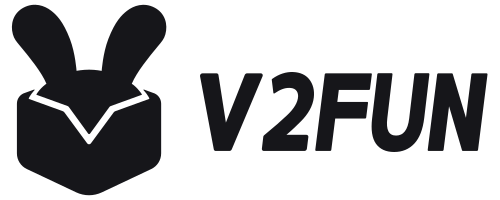

<div align="center">

<a href="https://v2fun.ai/">
  <picture>
    <source media="(prefers-color-scheme: dark)" srcset="assets/logo-dark.svg" />
    
  </picture>
</a>

# V2Fun Dance Game

**将视频与带骨骼角色制作成劲舞团式网页节奏游戏**

方向组合、节拍卡点与可定制的 Three.js 舞台。

[English](./README.md) | [简体中文](./README.zh-CN.md)

[](LICENSE)
[](#roadmap)
[](https://threejs.org/)
[](scripts)
[](https://v2fun.ai/)
[](https://discord.com/invite/2uBMRp275u)

</div>

---
## Live demos

| 演示 | 介绍 | View |
| --- | --- | --- |
| 默认角色劲舞团游戏 | 蓝白演出舞台、轻松/挑战/演示模式和原视频音乐 | [查看](example/index.html) |

## What it does

制作或改进支持键盘与触控的网页舞蹈游戏，包含轻松、挑战、演示模式，分数与连击判定、重开和无需 Logo、海报或舞台图片的程序化蓝白演出舞台。复用已有动捕，将带骨骼角色适配到 BVH。默认英文界面，支持中英切换。打开即尝试播放音乐；若被浏览器拦截，点击开启音乐或首次交互后播放。

模板支持一至两位舞者共用模型，是针对特定骨架的起点，不提供自动绑骨或通用重定向。不用于普通视频剪辑、独立动画或从零建模。

## How it works

1. 检查已有工程以及有权使用的媒体、带骨骼模型和动作。
2. 复用 BVH，或在当前服务授权内进行动捕。
3. 适配骨骼映射、动作起点、BPM 和节拍偏移。
4. 定制舞台，在电脑与手机上验证真实玩法。
5. 交付源码和静态构建；按用户要求部署。

[动捕说明](references/mocap.md)提供 API 工作流指引，不包含集成提交命令。无需安装其他 setup 技能。

## Quick start

### 选择素材

直接说：“使用 $v2fun-dance-game，帮我制作舞蹈游戏。”上传舞蹈视频和已绑定骨骼的角色，或明确选择默认视频／默认角色。仅上传其中一种时，可为另一种选择默认素材。不需要舞台图片或 BPM。

如果角色已带动画，选择动画片段，再提供音乐或用于提取音乐的视频。这条路线不调用视频动捕。同时提供带动画模型与舞蹈视频时，先确定使用哪一套动作。音乐与动画长度不一致时，选择截取、循环或调整速度。

新视频动捕默认仅身体动作，不包含独立手指动捕。付费调用前会询问是否需要手部动捕，并展示实时身体／手部方案的预计积分及差额。已有匹配结果及默认动捕直接复用，不新增动捕积分。详见[引导流程](references/onboarding.md)和[默认素材](references/default-assets.md)。

选择默认素材后，可以这样初始化：

```sh
python3 scripts/scaffold.py /path/to/default-game --use-defaults --three-dir /path/to/three-package
```

将文件夹放入 `~/.codex/skills/v2fun-dance-game/`，或自定义 `CODEX_HOME` 的 skills 目录，确保 SKILL.md 直接位于技能目录内。替换旧 v2fun-dance 安装以避免重复；保留游戏工程、任务 ID 和预算记录。

需要 Python 3.9+、Node.js 18+、版本一致的 Three.js 包和支持 WebGL 的浏览器。源码模板仍需指定 Three.js 包；已有单文件示例内嵌运行库。在技能目录执行：

```sh
python3 scripts/scaffold.py /path/to/new-game --assets-dir /path/to/prepared-assets --three-dir /path/to/three-package --dancers 2
cd /path/to/new-game
npm run build
npm start
```

使用 `$v2fun-dance-game` 并提供视频、带骨骼角色及已有 BVH，说明玩法与交付方式。[模板接入](references/starter.md)和[骨骼重定向](references/retargeting.md)说明素材要求与骨架限制。

省略素材与依赖两项参数时仅创建源码并报告缺项。已有目标目录会被拒绝。构建也会拒绝已有 dist；再次构建前检查并移走旧输出。骨骼不兼容时需修改映射。

本地初始化不需要密钥或付费调用。新 V2Fun 动捕需要当前授权、服务积分和执行环境中的 V2FUN_API_KEY。保存并恢复任务 ID，不重复提交结果不明的请求。内置示例复用已有动捕，本次未新增付费动捕。

## What you get

| 产物 | 内容与验收 |
| --- | --- |
| 源码工程 | 可编辑的玩法、舞台、角色适配器和界面 |
| 静态构建 | 补齐素材后，仅输出 public-files.json 明确列出的文件 |
| 可选部署 | 用户要求部署且成功后才提供实际网址 |

源码骨架不能证明动作、同步或游戏可玩性，详见[验证流程](references/verify-publish.md)。

## Roadmap

### v0.1.0

私有仓库版本，包含方向组合玩法、三种模式、舞台效果、明确的公开构建清单及输入和骨架检查。不是已打标签的 GitHub Release，示例的操作方式及节拍、接地限制见示例使用说明。

## Star history

此仓库为私有仓库，不提供公开星标历史数据。

[](https://github.com/V2Fun-Research/v2fun-dance-game)

## Sponsors

<a href="https://v2fun.ai/"></a>

V2Fun 支持此舞蹈游戏工作流与可复用舞台模板的开发。技能把创作者提供的视频、带骨骼角色与捕获动作连接到可编辑的网页玩法，重点是让节拍、角色适配、舞台表现和交付过程能够按项目需求调整。可直接复用已有素材，本地准备不要求付费服务调用。远程动捕是独立服务，具有单独的访问和积分要求。创作者需要选用有权使用的材料，并在目标设备上检查最终游戏体验；软件许可不替代素材授权和实际验收。

维护者：V2Fun Team · [Discord 反馈](https://discord.com/invite/2uBMRp275u)。

## Acknowledgments

感谢 [Three.js 及其贡献者](https://github.com/mrdoob/three.js)提供游戏使用的渲染、加载和后期处理 API。README 沿用 V2Fun 发布模板，其展示设计参考了 [img2threejs](https://github.com/img2threejs/img2threejs)。这些致谢不表示项目获得其背书。

## License

[MIT License](LICENSE)<br>
Copyright © 2026 V2Fun Team.

详见[第三方与素材范围](THIRD_PARTY.md)。MIT 适用于项目代码与文档，不授予商标、服务积分或第三方媒体权利。本项目不是劲舞团官方产品。
